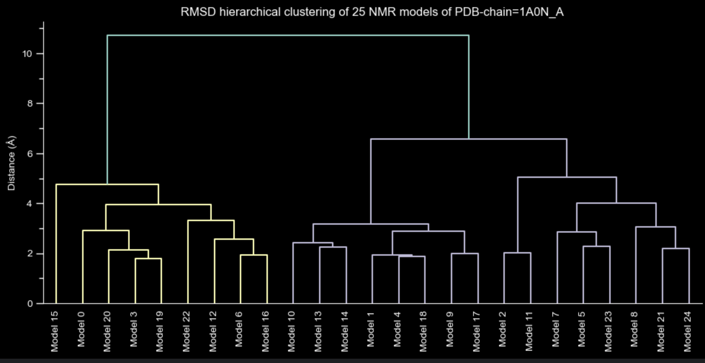
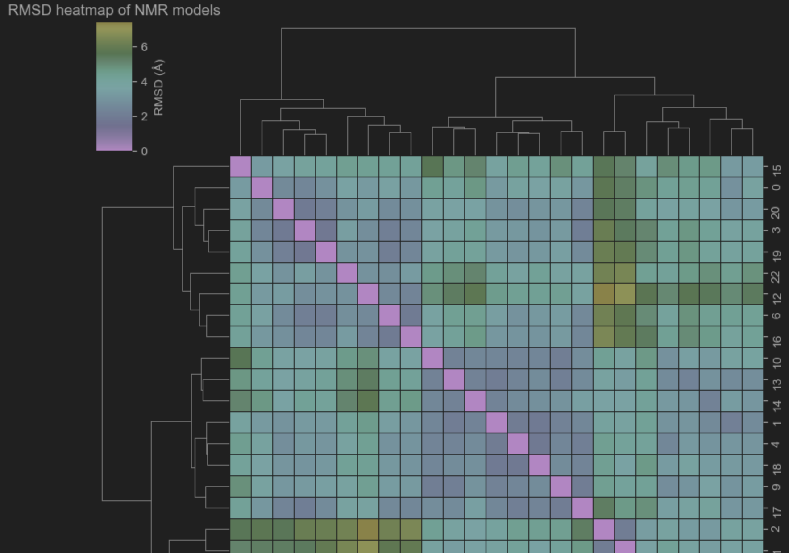
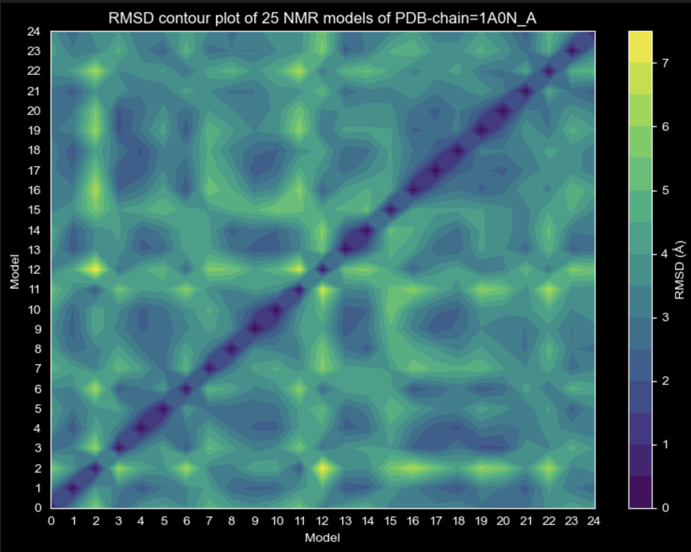

<details><summary><strong>Rationale for this mini-project:</strong></summary>

- A proof-of-concept exploration of the predictive capability of a diffusion model for alternate protein conformations.
  The focus of this mini-project remained on the preliminary methods for generating and characterising the required 
  dataset. (No model design, training or inference was done by me.)

- Performed, part-time, over a period of 3 months from mid-July to mid-Sept 2025.

- Inspiration for the project can be attributed to two papers in particular: Bryant & Noé Nature Comm. 2024 and 
  Lewis et al. Science 2025. (Note: Frank Noé authors both papers. He's the senior author for the Science paper along with 17 others. He's one of 
  only two authors for the Nature Communications paper with Patrick Bryant):

- <details><summary>Bryant & Noé 2024</summary><br>
  
  - If one retrieves pre-predicted structures from AlphaFoldDB, it currently yields one single protein structure, 
    albeit accompanied by per-residue confidence metrics (pLDDT). Bryant & Noé 2024 report that if one were to perform
    inference with AlphaFold (though this is not available as a service like AlphaFoldDB) or using some other 
    Evoformer-based model, a different structure can potentially be output - each time it is run. 
    Such alternative predictions which are supported by observations of deposited structures in the PDB might suggest 
    that the Evoformer-based model has learned the underlying molecular determinants for the potential promiscuity of 
    protein folding. However, Bryant & Noé point out that if the model was trained on a dataset that included these 
    different structures, then the aforementioned result could simply be due to the model memorising these different
    structures.
  - The motivation of this paper was to address this question directly, by assembling stratified training/test datasets 
    instead and training an Evoformer-based model accordingly. The protein dataset includes a proportion that has more 
    than 1 deposited structure - which is based on a TM-score threshold of 0.8.
  - The dataset included one chain only of each protein structure in the PDB, excluding NMR structures, to give 68953
    monomers.
    Crucially, they split any multi-structure proteins up, between training and test datasets, such that accurate 
    predictions of alternative structures cannot be attributed to memorising them during training.
  - They report that this strategy led to accurate predictions for about half of their multi-conformation proteins 
    dataset. Accurately-predicted structures were deemed to be so according to the TM-score of >0.8 between the 
    predicted alternate structure and the 'true' PDB-deposited structure.

- <details><summary>Lewis et al 2025</summary><br>

  - Like Bryant & Noé 2024, Lewis et al. also attempted to address the goal of predicting alternative protein 
    structures, but in this, much larger study, the full AlphaFold database of 200 million proteins was used. This was 
    clustered to restrict bias, and then increased further by augmentation (in which computationally-generated 
    structural variants were generated, based on what molecular rearrangments each AlphsFoldDB structure might undergo.
  - The model trained, which again was an Evoformer-based neural network, was further trained on even more protein 
    structures, this time from molecular dynamics simulations. Finally, it was fine-tuned on protein stability-related 
    metrics. Another big difference from the Bryant & Noé 2024 paper is that inference involves a different neural 
    network, in the form of the reverse diffusion model (the denoising part only). 
  - Thus, one protein sequence at a time is 'sampled', starting from random Gaussian noise, which is then subjected to
    a fixed number of denoising steps (30-50), all of which is conditioned on the trained Evoformer-based neural 
    network. The end product is a distribution of Cartesian coordinates for the given protein sequence. 
  - They also follow the careful approach of Bryant & Noé 2024 in terms of composing a test dataset of proteins that is 
    dissimilar to the training set. 
  - Predictions of observed conformational changes achieved success rates between 55% and 90% and included large domain 
    motions, local unfolding transitions, and the formation of cryptic binding pockets. 
  - BioEMu effectively emulated equilibrium distributons of MD simulations of protein folding and confomational 
    transitions, accurately and more rapidly. It effectively emulated equilibrum ensembles of small proteins from the 
    perspective of how mutations effect protein stabilities.
  - (I found it difficult to assess these reported success/accuracy metrics though.)

</details>

<details><summary><strong>Immediate goal:</strong></summary>

- Assemble and curate a dataset of protein structures that are observed to populate different conformations.
  For simplication, as well as to reduce computational demand, protein structures are parsed to contain alpha-carbons 
  only.

- The main activity included exploratory data analysis of all NMR structures available in the RCSB, as well as Python 
  implementations of different methods for characterising protein dynamics.

</details>

<details><summary><strong>4 distinct quantitations of protein dynamics:</strong></summary>

- Early on, the following two competing factors seemed to suggest the need to either over simplify the problem, or 
  devise a far more sophisticated approach to defining a dataset than simply plucking structures from the PDB: 
  1. The requirement of a very large dataset in order to succesfully train a deep neural network.
  2. The relatively small number of protein deposited with 2 or more clearly different structures, even fewer if 
     filtering out those that depend entirely on the presence of some external factor/binding partner. 
  
- Restricting one's self to NMR structures in the PDB, led to the question of how one determines, qualitatively, the 
  existence of different protein structures for a single protein. This in turn led to questions of how one quantifies 
  this. Different types of protein movement can be seen as distinct groups, albeit with unclear boundaries between them. 
  They include general flexibility/mobility, naturally-occuring ensemble populations, ligand-induced conformational 
  change, and non-native conformational changes.<br> 
  One commonly-used method for quantifying structural differences between identical protein sequences involves the 
  calculation of RMSDs. I apply the same method, using a variant of RMSD called the TM-score. 

- (Incidentally, one can directly visualise atomic structures of two or more models of a protein for which NMR data has 
  been deposited, in-browser, using the freely-available RCSB viewer. How to overlay protein structures is explained at 
  [rcsb/FAQs](https://www.rcsb.org/docs/3d-viewers/mol*/faqs-scenarios#how-do-i-view-all-models-of-an-nmr-ensemble). Scroll down to "How do I select specific models from an ensemble to see them ...?". Alternatively,
  standard tools (e.g. PyMOL, YASARA, etc) can of course be used instead.)

  - <details><summary><strong>RMSD and TM-score matrices and clustering:</strong></summary> 

    - Whenever you have Cartesian coordinates of a protein that populates a number of different conformations, you can 
    can make a reasonable attempt at characterising distinct structural groupings, via calculating RMSD or TM-scores 
    between them, followed by clustering. 
    - Using NMR structures that typically may have more than 10 models, one can construct RMSD matrices or TM-score 
    matrices, in which a scalar value of the difference between every pair of models is calculated directly from their 
    Cartesian coordinates, here done for alpha-carbons only. (Apart from the use of different models of NMR data, one 
    would also be able to apply this method to different time points in an MD trajectory).
    
    - Subsequent clustering of the RMSD/TM-score matrices makes it possible for candidate ensembles to be identified, 
    and this can be visualised via dendrograms and heatmaps. The utility of such visualisations was also helpful for 
    'sanity-checking' the calculations step-by-step, as it required the evaluation of both the protein structures 
    themselves, as well as the Python implementation of the method.
    
    - Despite similarities, RMSD and TM-scores are complimentary as each is suited to measuring different types of motion:

    | Aspect                       | **RMSD**                                           | **TM-score**                                           |
    |------------------------------|----------------------------------------------------|--------------------------------------------------------|
    | Basic idea                   | Avg Euclidean distance after optimal superposition | Length-normalised, distance-weighted structural similarity |
    | Dependence on protein length | Strong                                             | Weak (explicitly normalised)                           |
    | Sensitivity to domain motion | Very high – hinge/domain motion causes large RMSD  | Low – large separations are down-weighted              |
    | Local sensitivity            | Excellent for small, local deviations              | Poor for subtle local changes                          |
    | Global fold detection        | Weak                                               | Strong                                                 |
    | Typical use                  | NMR ensembles, MD trajectories, refinement         | Fold recognition, topology comparison                  |

  - <details><summary><strong>3 other methods:</strong></summary>
    
    - Upon exploring the literature, I came across 3, somewhat older, methods for measuring differences and dynamics that 
    measure different aspects of protein dynamics, different from the RMSD/TM-score method I use, as well as from each 
    other. They include: the calculation of difference-distance matrices(DDM); principal component analysis (PCA) for 
    'essential dynamics' (ED); Normal Mode Analysis (NMA).<br>
    The table below summarises these methods (including 2 different forms for calculating PCA for ED). <br>
    <strong>For detailed explanations of each method, go to the `Data files and Python scripts/src/` section below.</strong>
    
    - Note: A short time later, I was intruiged to find this combination of methods being incorporated into a new 
    software package ('EnsembleFlex'), in a very recent publication (Schneider et al. 2025). I haven't assessed here, 
    but it could be very useful for quick comparisons with the calculations made by the code in my project. 
    
  - <details><summary>Table of methods implemented here for quantitatively characterising structural variants and dynamics:</summary> 
  
    | **Method**                                  | **Core Algorithm / Mathematical Basis**                                                          | **Typical Post-processing / Clustering**                                                      | **What It Measures or Detects**                                                                  | **Pros**                                                                                                  | **Cons**                                                                            | **Required Inputs**                                                                    | **Relative Computational Demand** |
    | :------------------------------------------ | :----------------------------------------------------------------------------------------------- | :-------------------------------------------------------------------------------------------- | :----------------------------------------------------------------------------------------------- | :-------------------------------------------------------------------------------------------------------- | :---------------------------------------------------------------------------------- | :------------------------------------------------------------------------------------- |:----------------------------------|
    | **RMSD Matrix (all-vs-all)**                | Pairwise Euclidean distance between Cartesian coordinates; optionally after Kabsch superposition | Hierarchical clustering (Ward, average, complete), dendrograms, multidimensional scaling      | Overall structural dissimilarity between models (global or per-chain conformation)               | Simple, widely understood; directly interpretable; works even with few models                             | Sensitive to outliers and domain motions; loses local detail                        | ≥ 2 models of same atom order (typically Cα or backbone only)                          | low                               |
    | **TM-score Matrix (all-vs-all)**            | Sequence-independent superposition optimizing TM-score metric (length-normalized similarity)     | Same clustering or heat-map visualization as RMSD                                             | Fold-level structural similarity; insensitive to local disorder                                  | Scale-independent; robust to domain motions and chain-length variation                                    | Non-linear optimization; slower than RMSD; less local sensitivity                   | ≥ 2 protein structures (Cα or full-atom)                                               | moderate                          |
    | **Difference-Distance Matrix (DDM)**        | Element-wise subtraction of intra-model distance matrices; optional SVD alignment beforehand     | Spectral clustering (Laplacian eigenmaps); hinge scoring; domain segmentation                 | Localized internal rearrangements; hinge/bend detection; conformational subdomain identification | Captures internal geometry changes independent of global rotation/translation; interpretable residue-wise | Requires many models; sensitive to missing residues; needs long-range mask tuning   | ≥ 2 models with matched residue indices (Cα sufficient)                                | moderate                          |
    | **Essential Dynamics (PCA of coordinates)** | Eigen-decomposition of covariance (or correlation) matrix of aligned coordinates                 | Low-dimensional projection (PC1–PC2); optional k-means clustering in PC space; scree analysis | Directions of maximal correlated fluctuation across ensemble (collective motions)                | Physically intuitive; identifies dominant motions; easy visualisation                                     | Needs sufficient sampling; ignores time ordering; linear method                     | ≥ 10–20 models or MD frames, aligned (Cα or all-atom)                                  | moderate                          |
    | **Kernel PCA (non-linear extension)**       | Non-linear mapping via kernel trick (e.g., RBF) on top PCs or coordinates                        | Scatter plots in kernel PC space; silhouette or cluster analysis                              | Curved or anharmonic manifolds of motion; separates overlapping ensembles                        | Captures non-linear motions missed by linear PCA                                                          | Kernel choice and γ-tuning critical; less physically interpretable                  | Same as PCA (ensemble of aligned structures)                                           | moderate–high                     |
    | **Normal Mode Analysis (NMA)**              | Eigen-decomposition of Hessian of potential energy (2nd derivatives of energy wrt coordinates)   | Optional projection of trajectory onto modes; visualization of low-frequency modes            | Harmonic vibrational directions and frequencies near energy minimum                              | Physics-based; provides frequencies and force constants; requires only one structure                      | Harmonic approximation only; no anharmonic or diffusive motion; energy model needed | Single high-quality structure + parameterized force field (all-atom or coarse-grained) | high                              |


</details>

<details><summary><strong>Data files and Python scripts: </strong> $\leftarrow$ bulk of the detail for this project is in src/ subdir</summary><br>

- <details><summary><strong>data/</strong></summary>

  - Data files were not staged in git (but can all be generated by running code in `src` dir). 
  About 99 % of the data is in `NMR/` dir. `DynDom/` dir includes 239 scripts of Cartesian coordinates, sent by Prof 
  Hayward, amongst other data files scraped from DynDom webpages. `XRAY/` dir has a handful of haemoglobin structures, 
  downloaded ad hoc for testing one of the scripts (`diff_distance_matrix.py`). 
  Below is the full data directory structure and brief descriptions of files in each dir and subdir:
                     
  - <details><summary><strong>DynDom/</strong></summary>

    - 2 .html files & 2 .csv files
      Tables copied from DynDom webpages [DynDom](https://dyndom.cmp.uea.ac.uk/dyndom/) and scraped to CSV.

    - <details><summary><strong>Hayward_files/</strong></summary><br>
      
      - <details><summary><strong>OneDrive_1_14-01-2026/</strong></summary><br>
        
        - 239 flat files containing Cartesian coordinates of 2 protein chains identified as representing 2 different 
        conformations (eg. `ACETA2R3_scrptPD`).
    
      - <details><summary><strong>foldseek/</strong></summary><br>

        - <details><summary>1 subdir per PDB (e.g. 2DN1/)</summary><br>

          - <details><summary>21 Foldseek-related files</summary><br>

            - <details><summary>14 files output by Foldseek `createdb`</summary>
              
                ```
                2DN1: Binary database file containing the amino acid sequences (body).
                2DN1.dbtype: Small file telling FoldSeek what type of file this database is.
                2DN1.index: Index file mapping internal IDs to byte offsets in 2DN1, so entries can be fetched quickly.
                2DN1.lookup: Maps internal numeric IDs back to the original identifiers (PDB chain IDs, etc.).
                2DN1.source: Keeps track of where each entry came from (the input file paths, e.g. nameofpdb.pdb.
                2DN1_ca: Database of CA-only coordinates extracted from structure. Used for fast structural prefiltering.
                2DN1_ca.dbtype: Type marker for the CA database.
                2DN1_ca.index: Index mapping IDs to the positions of the coordinate records inside 2DN1_ca
                2DN1_h: Database containing headers/identifiers (what would appear after > in a FASTA, i.e. separate from amino acid sequence 'body'.)
                2DN1_h.dbtype: Type marker: tells Foldseek this DB holds headers, not bodies.
                2DN1_h.index: Index file for fast lookups in the header database.
                2DN1_ss: Database containing 3Di alphabet sequence for each residue; symbolic encoding of local 3D geometry.
                2DN1_ss.dbtype: Type marker for the 3Di database.
                2DN1_ss.index: Index for fast access to the 3Di database.
                ```

            - <details><summary>7 other files:</summary>
              
                ```
                2DN1.pdb: PDB input to Foldseek createdb.</summary>
                2DN1.aa.fasta: FASTA file of amino acid sequence dumped from 2DN1 via Foldseek's convert2fasta 2DN1. Each header line (from 2DN1_h) precedes the sequence body (from 2DN1).
                2DN1.3di.fasta: FASTA file of 3Di state sequences (structural alphabet letters) dumped from 2DN1_ss via foldseek convert2fasta 2DN1_ss. These strings encode local backbone geometry, one symbol per residue.
                2DN1_ss.fasta: Same as above — sometimes generated by older Foldseek versions or intermediate test scripts; contains 3Di alphabet sequences in FASTA format.
                2DN1_ss_h: Symlink (alias) to the header DB 2DN1_h, created as a workaround to satisfy convert2fasta when it expects a header DB specifically matching the _ss name.
                2DN1_ss_h.dbtype: Symlink to 2DN1_h.dbtype (type descriptor for the alias DB). Ensures consistency when accessing via _ss_h.
                2DN1_ss_h.index: Symlink to 2DN1_h.index. Provides fast lookup of header entries under the _ss_h alias.
                ```
  - <details><summary><strong>NMR/</strong></summary><br>

    - <details><summary><strong>datasets/</strong></summary><br>
      
      - <details><summary>pdb_chains_2713/</summary><br>
        
        - 1 .pdb file for each PDB-chains, e.g. 2713 .pdb files.
    - <details><summary><strong>mmseqs/</strong></summary><br>

      - <details><summary><strong>multimod_2713_hetallchains_hom1chain/</strong></summary><br>
        
        - <details><summary><strong>dir2delete/</strong></summary><br>
          
          - temporary output files generated by MMseqs2 which I programmatically delete to save memory.
        - <details><summary><strong>fasta/</strong></summary><br>
          
          - 1 big .fasta file: amino acid sequences of all PDB-chains, e.g. 2713.
        - <details><summary><strong>results/</strong></summary><br>
          
          - 1 big .csv file: all-vs-all alignment results (query | target | evalue | pident | alnlen | qcov | tcov).
    - <details><summary><strong>multimodel_lists/</strong></summary><br>
      
      - 4 .txt files: heteromeric & homomeric & single & multimodel pdb-chain ids (1 per line).
      - 2 .lst files: single & multimodel pdb-chain ids (1 per line).
    - <details><summary>parsed_cifs/</summary><br>
      
      - <details><summary>multimod_2713_hetallchains_hom1chain/</summary><br>
        
        - 2713 .ssv files
    - <details><summary>pdb_chains/</summary><br>
      
      - <details><summary>multimod_2713_hetallchains_hom1chain/</summary>
        
        - 2713 .pdb files: for each of 2713 pdb-chains (processed from 2713 mmCIFs, via Biopython).
        - <details><summary>mean_coords/</summary><br>

          - 2713 .pdb files: mean of models coords, per pdb-chain.
        - <details><summary>per_model/</summary><br>

          - <summary>(2713 subdirs, 1 dir per pdb-chain)/</summary>
            
            - 2-100 .pdb files per subdir: coords split by model to separate .pdb file, 1 .pdb per model.
    - <details><summary>prot_dynamics/</summary><br>

      - 52 .lst files (i.e. just trying it out with 52 pdb-chains): <= 20 RMSD scores for model pairs with highest scores, per pdb-chain.
    - <details><summary>raw_cifs/</summary><br>

      - <details><summary>heteromeric/</summary><br>
        
        - 1038 .cif files: 1 mmCIF per protein (all chains).
      - <details><summary>homomeric/</summary><br>
        
        - 686 .cif files: 1 mmCIF per protein (all chains).
    - <details><summary>raw_pdbs/</summary><br>
    
      - <details><summary>heteromeric/</summary><br>
        
        - 1038 .pdb files: 1 PDB per protein (all chains).

      - <details><summary>homomeric/</summary><br>

        - 686 .pdb files: 1 PDB per protein (all chains).
    - <details><summary>RMSD/</summary><br>
      
      - <details><summary>multimod_2713_hetallchains_hom1chain/</summary><br>
        
        - 2713 .csv files: RMSD scores of mean of models vs each model, for each of 2713 pdb-chains.
     - <details><summary>mean_coords/</summary><br>

       - 2713 .csv files: mean of models coords, for each of 2713 pdb-chains.(pre-calculated for use in calc of RMSD for mean vs each model, saved to .csv files in dir level above).
     - <details><summary>rmsd_matrices/</summary><br>
    
       - 2713 .npz files: RMSD scores of all-vs-all models, for each of 2713 pdb-chains.
    - <details><summary>stats/</summary><br>

      - <details><summary>multimod_2713_hetallchains_hom1chain</summary><br>
        
        - 1 .csv file: 1541 pdb-ids | head | all chains | heteromeric/homomeric | year | number of models.
        - 5 .csv/.lst files: various other stats.
    - <details><summary>TMscores/</summary><br>

      - <details><summary>multimod_2713_hetallchains_hom1chain/</summary>
        
         - 2702 .csv files: 2702 TM-scores for each model vs mean coords per pdb-chain. (11 of 2713 too short for TM-align).
         - <details><summary>tms_matrices/</summary><br>

           - 2702 .npz files: 2702 TM-scores for all-vs-all models per pdb-chain. (11 of 2713 too short for TM-align).
  - <details><summary><strong>XRAY/</strong></summary><br>

    - <details><summary>handpicked/</summary><br>
      
      - <details><summary>haemoglobin/</summary><br>
        
        - <details><summary>deoxy/</summary><br>
          
          - 2 files: 2DN2.cif & 2DN2.pdb.
        - <details><summary>oxy/</summary><br>

          - 2 files: 2DN1.cif & 2DN1.pdb.

- <details><summary><strong>src/</strong></summary><br>

  - <details><summary><strong>Root mean-squared deviation (RMSD):</strong></summary><br>
    
    A long-established and intuitive method which calculates a scalar measure of the difference between two sets of 
    atomic coordinates (Kabsch 1976). RMSD is suited to comparing pairs of alpha-carbon coordinates belonging to identical sequences, as is the case for 
    different models of the same NMR structure and so it was used here.
    A lower RMSD indicates a higher degree of structural similarity between two protein structures.
    `calculate_rmsd()` uses Biopython's `SVDSuperimposer()`, which uses optimal least-squares superposition, giving 
    the Euclidean RMSD between matched atom pairs. This is sometimes referred to as the 'Kabsch algorithm'.
    <p align="center">
    $\mathrm{RMSD} = \sqrt{\frac{1}{n}\sum\limits_{i=1}^{n} d_i^{2}}$
    </p>
    where the averaging is performed over the $n$ pairs of equivalent atoms and $d_i$ is the Euclidean distance between the two atoms 
    in the $i$-th pair.
    
    The units of the calculated RMSD value are the same as the units of the input coordinates, i.e. Ångströms.<br>
    RMSD is not normalised. The minimum possible value is zero and any RMSD over ~15 Å would strongly suggest error(s) 
    in the alignment and/or other calculation/data.
    
    ```
    RMSD:
    0 Å = Exactly identical. The exact same structure.
    < 1 Å = Essentially identical, only minor coordinate fluctuations.
    1-2 Å = Very similar, typically same fold, possibly different side-chain conformations.
    2-4 Å = Similar global fold; might differ in loops or flexible regions.
    4-6 Å = Moderate similarity; possibly different topologies or domain orientations.
    > 6 Å = Likely different structures; may be different folds entirely.
    > 10 Å = Almost certainly structurally unrelated.
    ```
    All computations are carried out in `RMSD.py`:<br>
    The main functions of use in the `RMSD.py` script are `calc_rmsds_matrix_of_models()` and `calculate_rmsd()`.
    
    `dendrogrm()` performs clustering and visualisations of RMSDs that provide a route to identifying and selecting 
    ensembles of conformational variants. It takes an RMSD matrix which is composed of an all-vs-all RMSD calculation
    whereby the RMSD of every pair of NMR models, for example, are stored in a matrix.<br> 
    `dendrogrm()` uses `scipy.cluster.hierarchy.linkage` function to build a hierarchical clustering tree 
    (a linkage/dendrogram) from the RMSD values.<br> 
    The linkage matrix it generates is then visualised via `scipy.cluster.hierarchy.dendrogram` function. For example:<br><br>
    

    The same linkage matrix can be re-used for a different visualisation, using `seaborn.clustermap()`. For example:<br><br>
    
    
    For a direct visualisation of the RMSD matrix without any clustering or pre-processing, using `contour_map()`. For example:<br><br>
    

    Clustering, without visusalisation, can be generated by `cluster_models()` for a given distance in Å, and will write 
    these to a json file.
    
    RMSD is good for local variations. It is very succeptible to minor mobile regions (i.e. disordered regions). 
    It would be a poor choice if the aim was to find proteins that have completely different structures, rather than 
    also identifying those displaying domain motions in which the structure of the domain itself is unchanging but its 
    position relative to the rest of the protein changes, e.g. about a hinge region. So, because all types of motion 
    are of interest here, both RMSDs and TM-scores does not penalise domain motion, so it is more useful for other, more subtle conformational variations.
  
  - <details><summary><strong>Template modeling score (TM-score):</strong></summary><br>
  
    Template modeling score (TM-score) can be used in a similar way to RMSDs, though it is designed to be less sensitive
    to protein lengths than RMSD (Zhang & Skolnick 2004). The algorithm tries different rotations, translations, 
    and residue correspondences. The reported TM-score is the highest (i.e. best) value found.<br> 
    TM-score uses nonlinear weighting of atomic distances, calculated as follows:<br><br>
    <p align="center">
    $\text{TM-score} = \max \left[ 
    \frac{1}{L_{target}} 
    \sum\limits_{i=1}^{L_{aligned}} 
    \frac{1}{1 + \left( \frac{D_i}{D_0(L_{target})} \right)^2}
    \right]$
    </p>
    where $L_{target}$ is the number of residues in the target protein structure,<br>
    $L_{aligned}$ is the number of aligned residue pairs,<br>
    $D_i$ is the Euclidean distance (Å) between two aligned residues, $i$, after superposition,<br>
    $D_0(L_{target}$ is a normalisation factor that depends on the chain length. (This sets the distance at which a 
    residue pair’s contribution begins to drop off significantly.)
      
    ```
    TM-score:
    1.0 = Perfect structural match (identical structures).
    0.8 = Often considered nearly identical structures (small conformational shifts only).
    0.5 = Typically indicates same fold.
    0.2–0.5 = Partial/topological similarity.
    < 0.2 ≈ Random similarity.
    ```
    
    I opted to include the TM-score because it seems to complement the RMSD calculations, detecting different forms of 
    conformational variations which RMSD pays less attention to (like small deviations of 3-4 Å), while ignoring 
    large rearrangements (like domain motions moving 10 Å) that RMSD penalises heavily. 
    Unlike RMSD, TM-score is independent of the protein size.
    
    The 'over-sensitivity' of RMSD to domain motions was part of the reason a different metric was used for CASP 
    (i.e GDT) (Zemla et al. 2001). (GDT was not replaced with TM-score for reasons of consistency with previous CASP 
    competitions.)  
    
    All computations are carried out in `tm_aligner.py` and are self-explanatory:<br>
    
    ##### Installing TM-align:<br>
    Installed according to github instructions: https://zhanggroup.org/TM-align/ <br>
    Rocky Linux: Compile TMalign.cpp with `g++ -O3 -ffast-math -lm -o TMalign TMalign.cpp`. <br> 
    (Note: `-static` command was left out for both Rocky Linux and Mac).<br>
    Mac: in `basic_fun.h` on line 10 `// #include <malloc.h> //` is replaced by `#include <stdlib.h>` which was already 
    on line 6. So, after commenting out `include <malloc.h>` and then compiling, I deleted all other files including 
    `basic_fun.h`.<br>
    The TMalign compiled binary executable file (along with the TMalign.cpp and TMalign.h files) are located in 
    `src/TMalign_exe/Darwin` or `src/TMalign_exe/Linux`. `tm_aligner.py` detects which OS it's running on before building 
    the correct relative path.
  
  - <details><summary><strong>Difference distance matrix (DDM):</strong></summary><br>
  
    A distance matrix is a simple and intuitive method for representing protein structure by calculating the relative 
    distance of atoms from one another (Crippen 1977). It is pre-dated by the 'distance map', which is essentially the 
    same thing (Phillips 1970). The distance matrix is a precursor to the widely-adopted 'contact map' method 
    (Havel et al. 1979) and the 'local distance difference test' (lDDT) (Mariani et al. 2011), both of which are just 
    functions of the same distance geometry measurements).
    By its very nature, a distance matrix is rotationally and translationally invariant. Another way of saying this is 
    that: it is "invariant under the Euclidean group E(3)". As such, there is no point in performing a superimposition 
    of the two protein conformers being compared (which for example, you do need in RMSD calculations).<br> 
    
    The method is based on the comparison of the Cartesian coordinates of two, otherwise identical, proteins. 
    For example, two NMR models of a protein structure. A distance matrix is calculated for each of these two structures. 
    The absolute value of their arithmetic difference is the 'difference-distance matrix' (DDM). 
    This DDM can now be used to locate mobile rigid domains (Nichols et al. 1995).
    The DDM is processed here to help identify and label distinct protein conformational ensembles, via an appropriate 
    processing and clustering algorithm, described below. 
    
    All computations are carried out in `diff_distance_matrix.py`:<br>
    The main functions are `compute_ddms(pidc_pdf)` and `analyse_ddms()`.<br> 
    `compute_ddms(pidc_pdf)` takes a parsed mmCIF of a single NMR protein chain, read from an already parsed copy as an 
    .ssv file. This contains all the NMR models for that protein chain, and is read into a Pandas dataframe ('pidc_pdf'). 
    It computes the DDMs of all-vs-all NMR model pairs for a given protein chain, i.e each DDM is the difference between 
    one pair of NMR models.  
    The subsequent clustering is done via converting the DDM data into a graph and is performed by the other main function 
    in `diff_distance_matrix.py` which is called `analyse_ddms()`. 
    It uses spectral clustering which essentially constructs Laplacian eigenmaps and uses them as the feature space for 
    clustering.
    The process requires first generating features from the DDM, for each residue that quantifies how its distances to all 
    other residues change across the full ensemble (of models). 
    Features' cosine similarities quantify how similar two residues' patterns are to each other, across the ensemble 
    thereby giving a measure of coordinated motion. Having gone from Cartesian coordinates to pairwise similarities, the 
    subsequent clustering is suited to graph-based pre-processing methods, hence spectral clustering, 
    (rather than GMMs or k-means directly on the coordinates or similarities matrix). This is more suited to dealing 
    with non-convex clusters (meaning connecting lines between at least one pair of points is outside of the cluster it 
    belongs to, i.e. the cluster is not 'round').
    Spectral clustering involves first converting the graph into its Laplacian eigenvectors, on which any one of a number 
    of clustering algorithms can now be applied. 
    Spectral clustering treats the similarities data as a graph, with residues as vertices and cosine similarities of 
    residue pairs as edges. When data is in the form of a graph, clustering involves partitioning it into subgraphs. 
    A subgraph is defined as vertices that have stronger edge strengths between them, and weaker edge strengths with 
    vertices of other subgraphs. 
    The algorithm proceeds by computing a graph Laplacian ($L$) (aka 'Laplacian matrix'), which is the difference between 
    the degree matrix ($D$) and the similarity matrix ($A$), i.e.: $L = D-A$. The eigenvectors of the graph Laplacian are 
    then calculated, which has the effect of assigning similar coordinates values so that they end up close  in the 
    embedding (i.e. capturing 'smooth' variations across the graph). Finally, clustering on this low-dimensional embedding 
    is performed, using the selection passed to `assign_labels` argument of`SpectralClustering()`, e.g. the standard 
    centroid-based method, k-means. The eigenvectors essentially "unfold" the graph so that densely connected nodes 
    (i.e. residues that move together) sit near each other in the new space, making them easy to separate using k-means. 
    
    The relative effectiveness of using different cluster numbers is calculated by the silhouette score metric.  
    The silhouette score calculates how well the graph-defined clusters (i.e. output of the spectral clustering step) are 
    actually separated in feature space. In `compute_ddms()`, the silhouette scores using 2, 3 or 4 clusters are calculated
    and compared, in order to find which one produces the best clustering.<br><br>
    <p align="center">
    $s_i = \frac{b_i - a_i}{\max(a_i, b_i)},$
    </p>
    where $a_i$ is the average distance to points in the same cluster, and $b_i$ is the smallest average distance to 
    points in the nearest other cluster.
    
    To focus on rigid-domain body movements (i.e. domain re-arrangements; hinge motions), the default value for argument 
    ` min_seq_sep` is 5. This is used to mask out any variations within 5 adjacent residues. 
    
    | `min_seq_sep` value | What pairs are excluded (`\|i–j\| < min_seq_sep`)                         | Biological signal emphasised |
    |:--------------------|:--------------------------------------------------------------------------|:------------------------------|
    | **1–2** | Only self and immediate neighbours (peptide bonds)                        | Very local motions — side-chain shifts, small backbone bends |
    | **3–5** *(default)* | Suppresses secondary-structure contacts (helical turns, $\beta$-hairpins) | Sub-domain or short-loop rearrangements |
    | **6–10+** | Ignores most local pairs; only long-range residue interactions remain     | Large-scale rigid-body domain movements or hinge motions |
    
    ##### What this script can do and how to use it:
    Identify protein pairs displaying rigid-domain motion as well as the regions within the proteins that move. 
    It may be possible to modify (including reducing `min_seq_sep`) in order to focus instead on local conformational 
    changes, such as secondary structural change. 
    'Protein pairs' can be pairs of NMR models, MD trajectories, or other where the sequence is identical.
    It might be possible to modify to allow use of protein pairs that are structurally related but are not identical in 
    sequence. However this has not been attempted here.  
    
    Strengths of DDM method include: 
    - its relative simplicity 
      - interpretability
      - low computational requirements 
      - identifying rigid-domain motions in proteins 
    
    Weaknesses of DDM method include:
    - needs identical protein sequence pairs
      - not many examples in literature of tihs method (c.w. essential dynamics and NMA) 
  
  - <details><summary><strong>Essential dynamics (ED):</strong></summary><br>
  
    Information related to the collective motions in proteins can be extracted by principal component anaIysis (PCA) of the 
    covariance matrices of Cartesian coordinates, given a sufficient number of models (such as from an MD trajectory or NMR data).
    (Karplus & Kushick 1981, Hawyard et al 1993, Amadei et al 1993).

    The goal is to find orthogonal directions (aka 'modes') that maximise variance of the data. Compelling evidence for the 
    application of PCA in identifying dynamic regions within proteins has long since been presented, both in terms of its 
    correspondence with published NMR as well as X-ray structures of proteins crystallised in different conformations. 
    In addition, the co-location of dominant principal component profiles with immobile regions, including highly conserved 
    catalytic sites, lends further weight to the validity of this mathematical treatment of Cartesian coordinates for the
    identification and quantification of functionally-relevant dynamics. PCA of multiple conformations identifies robust 
    modes which indicate directions of conformational change that are energetically favoured by the particular topology of 
    native contacts (Yang et al. 2009).<br> 
    
    All computations are carried out in `essential_dynamics.py`:<br> 
    In summary, this script does the following:
    - Computes PCA, which comes in the form of eigenvalues, eigenvectors and scores.
      - Generates a scree plot, which indicates which modes matter (i.e. a global picture). It addresses: “how many meaningful modes?”
      - Generates a PC1–PC2 scatter plot, which indicates how models distribute along those modes (i.e. the geometry of conformational space). It addresses: "what do these modes do to the ensemble?”
      - Calculate per-residue weighted RMSD modes to locate hinges/domains.
    
      - optional functionality in the pipeline:
        - $k$-means clustering on the PC scores, to automatically assign cluster labels.
        - kernel PCA performs RBF kernel PCA on the leading PC scores to obtain a non-linear embedding that can reveal 
          ensemble separation not visible with linear PCA alone. 
    
    The main function in this script is `essential_dynamics_pca()`. It begins by aligning the Cartesian coordinates of 
    atleast 2 models, but ideally many more ($\geq$ 10-20 models), of a protein (via `align_all_to_ref()` which uses 
    SVD in the same way as used for calculating RMSDs).
    This is followed by a covariance computation and eigenvalue decomposition (in `pca_evd()`). Prior to the covariance 
    computation, the data matrix is row-centered and, optionally, normalised (in `build_data_matrix()`) which would convert 
    it into a correlation matrix once the covariance computation has been performed on it. Thus, there is a choice between 
    using a covariance matrix or a correlation matrix. Use of a covariance matrix would mean that features (i.e. atomic 
    coorinates) with large absolute variance, dominate the variance. Whereas use of correlation matrix instead would mean
    that features with a strong co-variation pattern (even if the amplitude is small) dominate the variance. So, the 'raw' 
    covariance matrix indicates where the system (i.e. atoms) moves the most in real space (Å), while the normalised form 
    (i.e. the correlation matrix) indicates which coordinates fluctuate together in a consistent pattern, regardless of 
    scale. This is because the normalisation step changes the geometry of the subsequent PCA space. Potentially then, this 
    script would be able to focus, approximately, on these two different types of protein dynamics. The default setting 
    though is to use the 'raw' covariance matrix, rather than the correlation matrix.<br> 
    <p align="center">
    $\textbf{C} = \frac{1}{M - 1} (\textbf{X} - \bar{\textbf{X}})^{\top} (\textbf{X} - \bar{\textbf{X}})$<br>
    </p>
    
    where $\textbf{C}$ is the covariance matrix,<br>
    $M$ is the number of NMR models (or frames in MD trajectory),<br>
    $\bar{\textbf{X}} = (\bar{x}_1 ,\; \bar{x}_2, \; \cdots, \; \bar{x}_p)$,<br> 
    $\bar{x}_i = \frac{1}{M}\sum\limits_{k=1}^{M} x_i^{(k)}$ which is the mean of the Cartesian coordinate for atom $i$ across $k$ NMR models (or frames in MD trajectory).<br>
    So, $\textbf{X} - \bar{\textbf{X}}$ converts locations to fluctuations, and the covariance of this encodes how atoms move together in space. 

    (For the correlation matrix, the normalisation and covariance computation can be done in either order. In the script,
    the normalisation is done first, followed by the covariance computation. In the formula below, it is done the other 
    way round, but gives the same result because matrix $\textbf{D}$ is diagonal and positive definite.)
    <p align="center">
    $\textbf{R} = \textbf{D}^{-1} \textbf{C} \, \textbf{D}^{-1}$
    $\textbf{D} = \mathrm{diag}(\sigma_1, \sigma_2, \ldots, \sigma_p),
    \quad \sigma_i = \sqrt{C_{ii}}$
    </p>
    where $\textbf{R}$ is the correlation matrix,<br> 
    $\textbf{D}$ is the scaling matrix,<br>
    and $\sigma$ is the standard deviation.<br>
    Equivalent, per-element format (as the Python in `build_data_matrix()`): 
    $R_{ij} = \frac{C_{ij}}{\sigma_i \, \sigma_j}$
    
    The eigendecomposition is done (by numpy built-in function) producing the eigenvalue(s), each of which tells you how 
    much an ensemble fluctuates along that mode; and the corresponding eigenvector(s) (of shape 3N, where N is the number of 
    atoms)), each of which tells you the actual pattern of motion in terms of which atoms move where when the protein moves 
    along that mode. Scores generated by projecting each model to the eigenvectors indicates how much each model conforms 
    to each mode. These scores help identify protein structural conformers. 
    The eigenvalues on the other hand indicate how important each mode is, as in how much each mode contributes to the 
    total ensemble variance.
    A scree plot of eigenvalues visually indicates how many modes (e.g. PC1-PC3) to keep and how much of the total motion 
    they capture (e.g. 80-90%), i.e. where to stop before you are just looking at noise. In other words it helps identify 
    how many principal modes are needed to capture the essential dynamics of the given protein. If the plot does not have 
    a clear elbow, i.e. if the eigenvalues do not decay strongly (no dominant large eigenvalues), then PCA did not find 
    strong collective motions. 
    For example if the a lot of the variance is explain by the first principal component such that:
    $\frac{\lambda_{1}}{\sum_{i} \lambda_{i}} > 0.40$, then we know there is very strong global motion, typical of 
    hinge-bending and domain closure. If variance is explained by first $k$ PCs: 
    $\frac{\sum_{i=1}^{k} \lambda_{i}}{\sum_{i} \lambda_{i}} > 0.70$, then the protein has low-dimensional collective 
    dynamics, instead of or in addition to the one dominant global (hinge-like) motion.
    
    The scatter_pc() function plots two PCs against each other in 2D plot, to examine the PC1-PC2 space for example.
    The PC1–PC2 scatter plot tells you whether models separate into states or stay as one cloud. If they separate, the 
    different appearances this separation can manifest as can be approximately interpreted in the following way (table):  
    
    | Pattern               | What you see in PC1–PC2 | What it means physically         |
    | --------------------- | ----------------------- | -------------------------------- |
    | **Distinct clusters** | Separate blobs          | Multiple discrete conformers     |
    | **Trajectories**      | Ordered line-like path  | Continuous conformational change |
    | **Curved manifold**   | Bent arc or curve       | Multi-mode nonlinear motion      |
    | **Transitions**       | Bridge between clusters | Interconversion between states   |
    | **Branches**          | Tree-like splits        | Multiple flexibility pathways    |
    
    Optionally, PCA scores can be clustered. This is done by manually selecting and passing an integer to $try_kmeans_k$ 
    via the main function `essential_dynamics_pca()` specifying what $k$ to try for the clustering, 
    (via `sklearn.cluster.KMeans`).
    The silhouette score metric is then used for assessing the result of the $k$-means-created cluster. (Note: silhouette
    scoring was also used in the difference-distance matrix method above but in that case it was applied to the output of 
    graph clustering.)  
    
    For each mode, `essential_dynamics_pca()` then calculates root-mean-squared deviation (RMSD) amplitudes for each residue, 
    in Ångströms. It's important to note that while it's technically correct to refer to this as the 'RMSD', it's not exactly the 
    same RMSD metric widely used in modern structural biology. Mathematically, it is still a root-mean squared 
    displacement calculation, however it is the RMSD *amplitude per residue for a given mode*. This is more akin to the older 
    (PCA/ED 1990s) application of calculating the RMSD for a single structure compared to a mean of several structures, as 
    opposed to a pairwise comparison of two sets of coordinates, used for measuring the difference between two models or 
    trajectories of a protein. 
    
    <p align="center">
    $A_i(r) \;=\; \sqrt{\lambda_i}\,\|\textbf{v}_{i,r}\|
    \;=\;
    \sqrt{\lambda_i\left( v_{i,r_x}^2 + v_{i,r_y}^2 + v_{i,r_z}^2 \right)}$
    </p>
    where $\textbf{v}_i$ is eigenvector $i$ (unitless shape) and $\lambda_i$ is the variance (Å$^2$).<br> 
    Yielding $A_i(r)$, the displacement amplitude (Å) of residue $r$, along eigenvector $i$.
    
    Before returning, `essential_dynamics_pca()` offers the option to perform kernel PCA (kPCA). Unlike applying 
    eigendecomposition directly to Cartesian coordinates (i.e. standard PCA, which is already computed by default earlier 
    in this function), kPCA involves eigendecomposition of the centred Gram matrix. 
    kPCA is only useful when you have either:
    - a non-linear manifold (i.e. the ensemble does not lie in a relatively straight cloud in PCA space, but instead is curved, S-shape, spiral, branching, etc.) 
      - and/or you have overlapping conformers (i.e. multiple conformational substates (open, closed, half-open), but their points are overlapping in linear PCA space
      such that clustering gives ambiguous boundaries).
    
    The scatter plot of the linear PCA provides a way to determine if kPCA would be a useful additional step, but currently
    this relies on manual visual inspection of the PC scatter plots, as follows:
    - Standard linear PCA is probably enough if the PC1–PC2 plot looks like a single roughly elliptical cloud which is maybe 
    slightly elongated, or two-ish clouds that are already nicely linearly separated, or has structure that looks fairly 
    straight/convex/Gaussian-ish.
    
      - kPCA may be worth doing to see if kPC1–kPC2 gives cleaner separation, if your PC1-PC2 plot from linear PCA has a weak 
      “banana” shape, or a slightly curved arc, or clusters that overlap partially, or a suggestive but not super clear 
      separation.
    
      - Analysis is highly likely to benefit from kPCA when PCA indicates there is strongly nonlinearity, based on the 
      PC1–PC2 plot having a strong banana or C-shape, or an S-shaped curve, or a loop or ring (e.g. closed trajectory), 
      or is branching (like a Y or tree), or several clusters that are entangled along a curved path. In this case, kPCA 
      can unwrap a curved path into a straighter axis, separate overlapping substates and reveal clearer cluster 
      structure/transitions.
    
      - When the number of models is too few (e.g. 10–20 NMR models), patterns can look noisy. With lots of noise, curvature 
      might be obscured but as a first-pass visual diagnostic, PC1–PC2 is sufficient. But for a slightly more thorough 
      approach, you might also plot PC1–PC3 and PC2–PC3 and only bother with kPCA if at least one of those 2D PCA plots 
      shows clear curvature or entangled clusters.

    `essential_dynamics_pca()` returns the eigenvectors, the eigenvalues, the scores, the rmsd amplitudes per mode, and if 
    also computed the kPCA scores. The utility of each:
    
    | Conceptual ED output                      | Meaning                                       | Returned variable                                                |
    | ----------------------------------------- | --------------------------------------------- | ---------------------------------------------------------------- |
    | **Dominant motion directions**            | PC directions in 3N space                     | `eigvecs` (columns)                                              |
    | **Mode shapes**                           | Per-residue 3D displacement vectors           | `eigvecs` reshaped to (N,3)                                      |
    | **Per-residue contributions**             | Movement amplitude per residue (hinge finder) | `wrmsd_modes`                                                    |
    | **Visualisable structural displacements** | Coordinates you can morph along modes         | combinations of `aligned_coords`, `eigvecs`, `eigvals`, `scores` |
    | (Optional nonlinear geometry)             | Curved-manifold embedding                     | `kpca_scores`                                                    |
  
    (List of webservers and current status:
    Webserver | STATUS
    PCA_NEST | Seems to be non-functional
    At least one server exists (Yang et al. 2009 [PCA_NEST](http://ignm.ccbb.pitt.edu/oPCA/PCA.php)) purely for PCA 
    analysis for essential dynamics using PDB as inputs but I am not finding it to be robustly functional. I cannot find
    any Github URL for this but given it was 16 years ago, it's not unlikely that it has not been maintained recently.)
  
  - <details><summary><strong>Normal Mode Analysis (NMA):</strong></summary><br>
  
    Normal mode analysis (NMA) is used as a predictor of feasible domain motions, not a simulation of them. It models a
    protein as fully connected graph and treats this as a harmonic oscillator, from which it quantifies small harmonic
    oscillations. These are restorative motions based on some approximate assumptions that the given structure's atomic 
    coordinates correspond to a relaxed, near-equilibrium conformation, i.e. one that lies in a local minimum of the energy 
    landscape.
    NMA describes only the small, near-equilibrium harmonic fluctuations that restore that minimum.
    NMA cannot describe motions that cross into other basins or large anharmonic transitions.
    Accordingly, an X-ray crystal structure or a cryo-EM model (without steric clashes) is typically suitable for NMA.
    In contrast, a misfolded conformation is not suitable, and an MD snapshot is suitable only if it comes from an 
    equilibrated, relaxed portion of the trajectory rather than an arbitrary or early-frame snapshot.
    NMR structures might be useful but the model(s) chosen should be selected with care (ideally one in a relaxed 
    structure of a local minimum). The ensemble of structures provided by NMR may then also provide a benchmark for 
    comparison with the motions predicte by NMA.
    
    A harmonic oscillator arises when the potential energy of a system is approximated by a quadratic (parabolic) function 
    around an equilibrium configuration. 
    NMA relies on the eigen-decomposition of a Hessian matrix to obtain collective vibrational modes of a system.
    The Hessian is the matrix of second derivatives of the aforementioned potential, and it determines the stiffness 
    (curvature) of the harmonic oscillator in each direction, thereby defining the vibrational frequencies.
    (The source of the potential can be quantum, molecular mechanics, coarse-grained, or anything else.)
    
    Elastic network models (ENMs) are a special case of NMA, where the potential is simplified (to Hookean springs between 
    nodes within a cutoff). Gaussian network models (GNMs) and anisotropic network models (ANMs) are two different 
    implementations of ENMs. ENMs are not alpha-carbon only by default, but as it has been shown that alpha-carbon-only 
    ENMs reproduce the same low modes as full-atom NMA (Bahar & Atilgan), alpha-carbon-only became the standard 
    coarse-grained representation for ENMs and has been implemented here accordingly.
    
    Nosology:
    
    normal mode analysis (NMA)
        └── elastic network models (ENM)
                ├── Gaussian network model (GNM)  — isotropic ENM
                └── anisotropic network model (ANM) — anisotropic ENM
    
    | Model    | Matrix size    | Eigenvector contains           |
    |----------|----------------|--------------------------------|
    | Full NMA | (3N \times 3N) | 3D displacement vectors (i.e. direction of motion) |
    | ANM      | (3N \times 3N) | 3D displacement vectors (i.e. direction of motion)       |
    | GNM      | (N \times N)   | scalar participation per residue |
    
    NMA provides the mathematical machinery; ENMs specify a particular harmonic potential used in NMA. 
    GNMs are an isotropic ENM producing a scalar Laplacian. ANMs are an anisotropic ENM producing a full 3Nx3N Hessian.

    It can identify **directions** in which the protein would move if large motions were allowed.
    The harmonic approximation yields normal modes that mathematically assume small-amplitude oscillations. However, a
    surprising result has emerged, namely that lowest-frequency normal modes predicted by these harmonic models align 
    extremely well with the directions of biologically functional, often large-scale, motions.
    Tirion, M. M. (1996). “Large amplitude elastic motions in proteins from a single-parameter, atomic analysis.” Physical Review Letters 77: 1905–1908.
    Bahar, I., Atilgan, A. R., & Erman, B. (1997). “Direct evaluation of thermal fluctuations in proteins using a single-parameter harmonic potential.” Folding & Design 2: 173–181.
    Atilgan, A. R., Durell, S. R., Jernigan, R. L., Demirel, M. C., Keskin, O., & Bahar, I. (2001).
    “Anisotropic network model (ANM): A robust tool for characterizing global motions of proteins.”  Biophysical Journal 80: 505–515.
    
    As with essential dynamics (ED), NMA involves the eigendecomposition of a symmetric 3N x 3N matrix in 
    coordinate space. However, instead of eigendecomposition of the covariance of Cartesian coordinates, NMA 
    involves the eigendecomposition of the second derivates (Hessian) matrix of the potential energy. 
    
    ##### Disambiguation of the term 'mode' in ED vs in NMA:<br>
    Note the use of the term 'mode' in ED is urelated to the use of the term 'mode' in NMA. Their only similarity is that 
    they are both calculated via the same mathematical object type: eigenvectors.<br>
    In PCA/ED: “modes” come from eigenvectors of covariance of observed coordinates.
    In NMA: “normal modes” come from eigenvectors of Hessian of energy model.
    Both are measures of collective motion patterns, but their similarity ends there.
    
    | Feature              | ED/PCA Mode                                         | NMA Normal Mode                     |
    | -------------------- | --------------------------------------------------- |-------------------------------------|
    | Derived from         | Covariance of observed coordinates                  | Hessian of potential energy         |
    | Assumes harmonicity? | No                                                  | Yes                                 |
    | Represents           | Empirical dominant motions                          | Vibrational modes with frequencies  |
    | Suitable for         | Domain motions, ensembles, conformational variability | Small oscillations near equilibrium |
    | Interpreted as       | Statistical **principal directions**                | Physical **vibrational eigenmodes** |

    NMA does not rely having two or more Cartesian coordinates for a protein. 
    It can be applied on a single set of Cartesian coordinates of a protein. 
    NMA is designed for computationally estimating small-scale dynamics of protein structure given only a single (static) 
    set of Cartesian coordinates. NMA is derived under the assumption of small-amplitude harmonic oscillations around a 
    single energy minimum. However, the low-frequency modes, although computed in this small-amplitude approximation, 
    have been repeatedly observed to align with the directions of large-scale functional motions such as hinge bending, 
    twisting, and breathing in proteins.
    
    Bauer et al. (2019) makes a case for the benefits of an increased adoption of NMA across the field of protein 
    structural biology. It is described as a relatively computationally-inexpensive method for identifying functionally 
    significant flexible states accesible to a protein about an equilibrium position (i.e. the given PDB structure). 
    It is based on the combination of the potential energy, kinetic energy and equations of motion. 
    The potential energy of the system $V(q)$, (which is reduced to only include the second term of a Taylor series), 
    can be written as:
    <p align="center">
    $V(q)=\tfrac{1}{2}\left(\frac{\partial^{2}V}{\partial q_i\,\partial q_j}\right)^{0}\,\eta_i\,\eta_j
    = \tfrac{1}{2}\,\eta_i\,V_{ij}\,\eta_j \,,$
    </p>
    Where $V_{ij}$ is the Hessian matrix (i.e. second derivatives of the potential with respect to the components of 
    the system). $V_{ij}$ contains information about how the position of one component of the system are tied to changes in 
    others. 
    
    The kinetic energy $T(q)$ can be written as:
    <p align="center">
    $T(q) = \tfrac{1}{2} M \frac{d^{2}\eta_{i}}{dt^{2}},$
    </p>
    where $M$ is mass of each particle.  
    The entire equation of motion can be written as their equivalence:
    <p align="center">
    $\tfrac{1}{2} M \frac{d^{2}\eta_{i}}{dt^{2}} + \tfrac{1}{2} \eta_{i} V_{ij} \eta_{j} = 0.$
    </p>
    
    One solution of the equation of motion above is the oscillatory equation:
    <p align="center">
    $\eta_i = a_{ik} \cos(\omega_k t + \delta_k),$
    </p>
    where $a_{ik}$ is the amplitude of oscillation, $\omega_k$ is the frequency,  
    and $\delta_k$ is a phase factor.  
    Substitute into preceding equation, and the entire equation of motion can be rewritten as standard eigenvalue equation:
    <p align="center">
    $\textbf{V} \textbf{A} = \lambda \textb{A}.$
    </p>
    where matrix $\textbf{A}$ contains the $\textbf{A}_k$ eigenvectors of the Hessian matrix $\textbf{V}$, which are 
    the normal mode vectors and describe in which direction and how far each atom moves wrt the others. The $\lambda_k$ 
    eigenvalues give the square of the frequencies at which all atoms involved in each mode vibrate. (This does not 
    give absolute amplitude of displacements).
    
    For each normal mode, the corresponding eigenvector provides the shape of its oscillation (i.e. the relative directions
    (x,y,z) of motion for each atom; while the corresponding eigenvalue provides its frequency. In theory, you would be able 
    to reconstruct the anharmonic oscillation of the protein as a whole by combining all of the normal modes, except for the
    fact that we still lack their amplitudes and the phases.
    
    Normal Mode Analysis (NMA) is derived from a harmonic (quadratic) approximation to the potential energy surface and 
    formally describes only infinitesimal oscillations around an equilibrium conformation. However, a major and 
    well-supported empirical observation is that the directions of the lowest-frequency normal modes align strongly with 
    the directions of biologically relevant, large-amplitude, anharmonic motions such as hinge bending, twisting, and 
    breathing. Thus, while NMA does not predict the amplitudes or time evolution of large motions, it does correctly 
    identify their principal geometric directions. This was first demonstrated by Tirion (1996), Bahar et al. (1997), and 
    Atilgan et al. (2001), forming the foundation of elastic network models.
    
    The NMA method involves diagonalising the Hessian of the potential energy of a protein, calculated from its Cartesian 
    coordinates. (Note: A `mode` refers to a collective vibration pattern of a protein that is independent from others 
    modes. They are modelled as small harmonic oscillations around an equilibrium structure. 
    A less computationally-demanding but very effective version of this is called the Elastic/Gaussian Network Model (REF X). 
    This model treats the protein instead as a harmonic oscillator, a graph where edges are springs connecting alpha-carbon 
    atoms within a cutoff distance, e.g. 10 Ångströms.  
    Like calculating the essential dynamics, it outputs the protein's modes and their amplitudes.   
    
    Here, the Python implementation of NMA is done with an ENM potential of the GNM type.
    
    All computations are carried out in `nma_gnm.py`:<br> 
    
    The main function `run_gnm()` implements the Gaussian network model given x,y,z coordinates of single protein, as 
    described above, via the 3 following functions that result in the :
    1. The Kirchhoff matrix via `_build_kirchhoff_matrix()`. <br>
    If residues $i$ and $j$ are within some cutoff distance, 
    connect them with a spring of uniform constant $\gamma$. So where we assume there are only springs between contacting 
    residues (alpha-carbon atoms), that these springs are isotropic, and finally that displacements are small. Under these 
    assumptions, the Hessian becomes the Kirchhoff matrix, ($\mathrm{L} = $\mathrm{D} - $\mathrm{A}$) which is what this 
    function returns  ('Gamma').
    2. The eigendecomposition for non-zero modes, via `_gnm_modes()`:<br>
    The Laplacian matrix is symmetric and positive semi-definite (PSD) by definition. Symmetry alone gives us nice spectral 
    properties. Specifically, it is guaranteed to have real eigenvalues, orthogonal eigenvectors and orthogonal 
    diagonalisation: $\Gamma=\textbf{U}\Lambda\textbf{U}^{\top}$<br> 
    Being PSD guarantees: all eigenvalues are non-negative; the existence of zero modes; and physical stability.
    The guarantee of physical stability reaffirms the point that our starting point was an assumption that the coordinates 
    are for a protein conformation that is in a local minimum. So we essentially encode that assumption explicitly by using 
    a matrix that is PSD by construction, via employing a harmonic model (which necessarily produces a PSD Hessian). 
    We then analyse the consequences of that assumption by examining the resulting modes and fluctuations.
    This function only returns the non-zero eigenvalues (and corresponding eigenvectors which correspond to the modes), 
    which together with the Laplacian matrix (returned from `_build_kirchhoff_matrix()`) are passed to `_gnm_fluctuations()`.
    (Each mode represents a direction in configuration space along which the system can move independently of other 
    directions. The associated eigenvalue tells you how much restoring stiffness there is along that direction.)
    3. Fluctuations and correlations via `_gnm_fluctuations()`:
    The `run_gnm()` completes the deriving of predicted collective conformational modes from a given protein’s alpha-carbon 
    coordinates using a harmonic network model, with a call to `_gnm_fluctuations()` which calculates the MSFs (which are 
    proportional to B-factors), covariance and correlation matrix, via constructing the Moore–Penrose pseudo-inverse of the 
    Laplacian. There is an option to plot the results, specifically MSFs and B-factors against the protein sequence.
    One can also plot the cross-correlation via `plot_matrix(corr)`. This shows, for every pair of residues, whether they 
    are predicted to fluctuate together, oppositely, or independently. Dark red indicates residues i and j are strongly 
    positively correlated (such that they tend to move together). White indicates weak or no correlation. Blue indicates
    residues are anti-correlated (such that they tend to move in opposite directions). So: 
       - Blocks of red indicate rigid (or semi-rigid) domains moving together.
       - Blocks of blue between domains indicate domains moving in opposite directions (like two jaws).
       - Sharp transitions between red and blue regions indicates hinges or pivot regions.
       - Long-range spots far from the diagonal indicate distant residues that are dynamically coupled.
    
    A summary of methods described and implemented in this codebase (not including 'Cartesian displacement'), what 
    diagonalisation is involved in each, how it's interpreted and what information each model is realistically capable of 
    predicting and/or characterising:
    
    | Model                                    | Matrix diagonalised               | What the eigenvectors represent                                   | Gives explicit Cartesian directions?                         | Resulting motion info                                                                                      |
    | ---------------------------------------- | --------------------------------- | ----------------------------------------------------------------- | ------------------------------------------------------------ |------------------------------------------------------------------------------------------------------------|
    | **Full all-atom NMA (Hessian)**          | (3N \times 3N)                    | Per-atom 3D displacement vectors from a physics-based force field | **Yes** — full atomic ((\Delta x,\Delta y,\Delta z))         | Predicted small-amplitude 3D displacement vectors for every atom; vibrational directions around a minimum  |
    | **ANM (Anisotropic Network Model)**      | (3N \times 3N)                    | Per-residue 3D displacement vectors (coarse-grained)              | **Yes** — residue-level directions                           | Predicted collective 3D directions of residue motion (hinges, domain rotations)                            |
    | **PCA / Essential Dynamics (MD or NMR)** | (3N \times 3N) covariance         | Dominant directions of *observed* Cartesian variance              | **Yes** — but data-driven, not predictive                    | Dominant *observed* displacement directions sampled experimentally or in MD                                |
    | **Cartesian displacement analysis (two structures)** | none (direct subtraction) | (\Delta \textbf{r}_i) vectors      | **Yes**                              | Exact per-residue displacement vectors between two aligned conformations                                   |
    | **Difference–Distance Matrix (DDM)**     | (N \times N) (pairwise distances) | Complete internal geometric change between structures             | **Implicitly yes** — internal geometry only, no global frame | Complete information about which internal distances change and by how much; no Cartesian directions        |
    | **GNM (Gaussian Network Model)**         | (N \times N) Laplacian            | Scalar participation / correlation patterns of residues           | **No** — isotropic, sign structure only                      | Predicted relative flexibility and correlated/anti-correlated regions                                      |
    | **Spectral clustering of graphs / DDMs** | (N \times N) Laplacian            | Relational partitions and collective groupings                    | **No** — partitions, not displacement vectors                | Identification of moving blocks, hinges, and collective rearrangement patterns                             |
  
    The table below aims to clarify the difference between what PCA/ED does vs what NMA does, and the different meanings of the word 
    'mode' in each: 
  
    | Concept/Object     | **Normal Mode (NMA)**                                                                   | **Essential Mode (PCA/ED)**                        |
    |--------------------|-----------------------------------------------------------------------------------------|----------------------------------------------------|
    | Matrix             | Hessian of potential $\left(\frac{\partial^2 \textbf{E}}{\partial \textbf{x}^2}\right)$ | Covariance of coordinates $(⟨\textbf{xx}^{\top}⟩)$ |
    | Physical basis     | Hooke’s law around equilibrium                                                          | Statistical sampling of observed dynamics          |
    | Eigenvalue meaning | $\omega^2$ is frequency $^2$, related to restoring force                                | $\lambda$ is variance (amplitude $^2$) of motion   |
    | Time dependence    | Sinusoidal (oscillatory) motion                                                         | Diffusive (non-periodic, stochastic)               |
    | Example            | Atom vibrates at 50 cm $^{-1}$                                                          | Domain swings back and forth over time             |

    'Normal modes' are oscillatory patterns determined by the energy landscape (physics-driven). <br>
    'Essential modes' are statistical patterns determined by the trajectory ensemble (data-driven).

    - <details><summary>Experiental validation of the utility of DDM, PCA-ED and NMA for protein dynamics:</summary>
  
      | Method / family                                                                        | Representative validation paper                                                                                                                      | Experimental observable(s) used                                                                                            | What was validated (in practice)                                                                                                                                                                                                                                                                 |
      | -------------------------------------------------------------------------------------- |------------------------------------------------------------------------------------------------------------------------------------------------------| -------------------------------------------------------------------------------------------------------------------------- | ------------------------------------------------------------------------------------------------------------------------------------------------------------------------------------------------------------------------------------------------------------------------------------------------ |
      | **Distance-Difference Matrices (DDMs)** on pairs/ensembles of crystal structures       | Rashin et al. (2009) ([PMC][1])                                                                                                                      | Large set of **pairs of independently solved X-ray structures** (RNase A, myoglobin, etc.)                                 | Uses DDMs over **1014 structure pairs** to quantify coordinate uncertainty vs genuine conformational change; shows that DDM patterns + empirically derived thresholds separate noise-level differences from functionally meaningful motions.                                                     |
      | **DDMs for ensembles / families + link to dynamics & sequence**                        | Friedland et al. (2009), ([PLOS][2])                                                                                                                 | **NMR RDCs** for ubiquitin, plus many **crystal structures** of ubiquitin and homologs                                     | Builds conformational ensembles whose **Cα DDMs** match RDC-derived dynamics and the diversity seen in crystal structures and sequence families; validates that DDM-captured structural variation corresponds to experimentally measured solution dynamics.                                      |
      | **PCA / Essential Dynamics (ED) on MD trajectories**                                   | Amadei et al. (1993), ([PubMed][3])                                                                                                                  | MD simulations benchmarked against known **X-ray structures** and their functional conformational changes                  | Introduces ED (PCA of covariance) and shows that **a small number of PCs** capture the large-amplitude motions associated with known conformational changes (e.g. HIV-1 protease, lysozyme); demonstrates that ED modes map onto experimentally established functional motions.                  |
      | **PCA of native structural ensembles** (many experimental structures rather than MD)   | Yang et al. (2009), ([OUP Academic][4])                                                                                                              | **Multiple crystal structures / NMR models** for the same protein or family                                                | Performs PCA on ensembles of experimentally determined structures and shows that leading PCs correspond to **functional motions inferred from different liganded states**, supporting PCA/ED as a way to extract biologically relevant dynamics directly from experimental structure ensembles.  |
      | **All-atom NMA with empirical force fields**                                           | Tama & Sanejouand (2001), ([PubMed][5])                | Pairs of **open/closed (or apo/holo) X-ray structures** for 20 proteins                                                    | Performs NMA around one experimental structure with a simple potential and shows that **linear combinations of a few low-frequency modes** reproduce the experimentally observed open↔closed transitions for many proteins, i.e. low modes encode functional conformational changes.             |
      | **Isotropic Elastic Network Model / Gaussian Network Model (GNM)** – B-factor matching | Bahar et al. (1997), ([ScienceDirect][6])  | **X-ray B-factors** from multiple crystal structures                                                                       | Introduces the (scalar) ENM/GNM and shows that predicted residue mean-square fluctuations **correlate well with experimental B-factors** for a set of proteins, despite the extreme coarse-graining to Cα nodes and a single γ parameter.                                                        |
      | **GNM vs hydrogen-exchange protection**                                                | Bahar et al. (1998), ([ACS Publications][7])   | **HX protection factors** (native-state H/D exchange), X-ray structures                                                    | Uses GNM to compute cooperative fluctuations and shows that predicted mobility patterns **correlate with HX protection**: residues in dynamically protected cores (low fluctuation in GNM) have low HX rates, linking ENM fluctuations to solution dynamics.                                     |
      | **Refined GNM for precise B-factor prediction**                                        | Erman et al. (2006), ([PMC][8])                                 | **B-factors** for a diverse protein set                                                                                    | Systematically tunes and extends GNM and reports **best-case correlation ≈0.66** between predicted and experimental B-factors across many proteins, arguing that ENMs provide quantitatively useful fluctuation profiles at near-atomic resolution.                                              |
      | **Anisotropic Network Model (ANM)** – directional ENM                                  | Atilgan et al. (2001), ([ScienceDirect][9])                | **Sets of X-ray structures** exhibiting domain motions; some comparison to MD                                              | Introduces ANM (3N×3N Hessian) and shows that low-frequency modes describe **observed hinge-bending and domain motions** seen in experimental open/closed structures and in MD trajectories, i.e. ENM with directionality reproduces functional deformation patterns.                            |
      | **Coarse-grained ENMs vs anisotropic experimental data**                               | Eyal & Bahar (2008), ([Cell][10])                            | Anisotropic B-factors / diffuse scattering and structural data for multiple proteins                                       | Demonstrates that **coarse-grained ENMs reproduce directionality and anisotropy** of experimental fluctuations (not just amplitudes), strengthening the case that ENMs capture the essential backbone of solution-like dynamics encoded in the structure.                                        |
      | **NMA vs Essential Dynamics (PCA) – cross-validation**                                 | Rueda et al. (2007), ([ScienceDirect][11]) | **MD trajectories** that themselves are validated against experimental structures & observables in the original MD studies | Compares deformation subspaces from coarse-grained NMA and ED for a large protein set; finds that the **low-frequency NMA subspace closely matches the ED subspace** when enough modes are included, validating NMA as a good surrogate for MD-derived (and experimentally calibrated) dynamics. |
    
      [1]: https://pmc.ncbi.nlm.nih.gov/articles/PMC2777169/?utm_source=chatgpt.com "Protein flexibility: coordinate uncertainties and ..."
      [2]: https://journals.plos.org/ploscompbiol/article?id=10.1371%2Fjournal.pcbi.1000393 "A Correspondence Between Solution-State Dynamics of an Individual Protein and the Sequence and Conformational Diversity of its Family | PLOS Computational Biology"
      [3]: https://pubmed.ncbi.nlm.nih.gov/8108382/?utm_source=chatgpt.com "Essential dynamics of proteins"
      [4]: https://academic.oup.com/bioinformatics/article/25/5/606/182911?utm_source=chatgpt.com "Principal component analysis of native ensembles of ..."
      [5]: https://pubmed.ncbi.nlm.nih.gov/11287673/?utm_source=chatgpt.com "Conformational change of proteins arising from normal ..."
      [6]: https://www.sciencedirect.com/science/article/pii/S1359027897000242?utm_source=chatgpt.com "Direct evaluation of thermal fluctuations in proteins using a ..."
      [7]: https://pubs.acs.org/doi/10.1021/bi9720641?utm_source=chatgpt.com "Correlation between Native-State Hydrogen Exchange and ..."
      [8]: https://pmc.ncbi.nlm.nih.gov/articles/PMC1630469/?utm_source=chatgpt.com "The Gaussian Network Model: Precise Prediction of Residue ..."
      [9]: https://www.sciencedirect.com/science/article/pii/S000634950176033X?utm_source=chatgpt.com "Anisotropy of Fluctuation Dynamics of Proteins with an ..."
      [10]: https://www.cell.com/biophysj/fulltext/S0006-3495%2808%2970422-3?utm_source=chatgpt.com "Toward a Molecular Understanding of the Anisotropic ..."
      [11]: https://www.sciencedirect.com/science/article/pii/S0969212607001414?utm_source=chatgpt.com "Article Thorough Validation of Protein Normal Mode Analysis"
  
  - <details><summary><strong>Other Python scripts:</strong></summary><br>
  
    - <details><summary><strong>Protein sequence alignments using MMseqs2:</strong></summary><br>
  
      - <details><summary><strong>Installing MMseqs2:</strong></summary><br>
        
        Installed on MacOS and Rocky Linux within activated conda env, and according to 
        https://github.com/soedinglab/MMseqs2: `conda install -c conda-forge -c bioconda mmseqs2`. 
        However, on Rocky Linux, I first installed aria2 with: `sudo dnf makecache` and `sudo dnf install aria2`.
    
      - <details><summary>`mmseqs2.py`</summary><br>
        
          Once installed, my script `mmseqs2.py` uses it. [MMseqs2](https://github.com/soedinglab/MMseqs2?tab=readme-ov-file) performs sequence alignments at least 100 times 
          faster than BLAST. It is primarily designed for sequence searching using many-to-many alignments for large 
          datasets. However, I am using here simply for sequence alignments and for relatively small datasets. I am using 
          it partly for the learning experience.
        
          The output is saved to one large csv with 7 columns: query, target, evalue, pident, alnlen, qcov, tcov. 
          2713 PDB-chains choose 2 gives over 3 million pairs: 
          i.e. $C(n, r) = \begin{pmatrix} n \\[4pt] r \end{pmatrix} = \dfrac{n!}{r! \, (n - r)!}  = \dfrac{2713!}{2! \, (2713 - 2)!} = 3678828$
          (Note: it could be even more if explicitly set to allow more than 1 alignment output for any given protein pair, 
          but default setting restricts to only 1 output per pair).
        
          The csv only has 33074 rows. This is because the default setting will exclude low-scoring alignment pairs. 
          This is primarily based on excluding low-scoring k-mers. (This 'k-score' is a sum of pairwise substitution scores 
          (BLOSUM62)) (Steinegger & Söding, 2017).
          The current version uses a default sensitivity parameter setting of 5.7 (`Sensitivity: 1.0 faster; 4.0 fast; 7.5 sensitive [5.700]`)
          It is expected that ~99% of hits are removed by this first step. There are a number of subsequent thresholds used to 
          further reduce the number of outputs, including ungapped alignment diagonal filter (default 15) (removing a further ~70-90% of 
          surviving matches), E-value (default $1e^{-3}$) (removing a further ~50%).  
        
          `evalue`: The expectation value is a statistical measure estimating how many alignments with this score or better 
          would be expected to occur by chance in a database of this size. Hence, an alignment with a smaller E-value is deemed 
          to be more statistically significant than a higher E-value.<br>
          $1e^{-45}$ is extremely significant; $1e^{-8}$ is still significant. Thus the high default of $1e^{-3}$ is only designed
          to serve as an inclusion threshold, whereby weak but potentially homologous matches may still be evolutionarily 
          meaningful. This high default reflects too the main intended use of MMseqs2, namely running on very large databases 
          (millions of sequences) that could contain distant homologues, potentially sharing < 25% identity.
          (MMseqs2's E-value of $1e^{-3}$ corresponds to BLAST's E-value of approximately $1e{-5} – 1e{-6}$ for the same dataset.)
        
          `pident`: The percent identity over the alignment is given by: $\frac{\text{Number of identical residues in alignment}}{\text{alignment length}} \times 100$
        
          `alnlen`: The alignment length, which is the number of aligned positions, including gaps if any.
          (Note: MMseqs2 performs local, not global, alignments by default. This setting can be changed though.)
        
          `qcov` or `tcov`: Query or target coverage is percentage of residues in alignment over length of the whole query 
          (i.e. full protein length).
        
          Example alignment of two very short proteins identical except for two  residues, one of the two differences 
          is E/D. E and D are similar but non-identical; the other is a gap/K:
          ```
          Query :  M   A   E   –   G   Q   L   V   T   T 
          Target:  M   A   D   K   G   Q   L   V   T   T
        
          alnlen = 10; 
          qcov = 100 x (9/10) = 90%; 
          tcov = 100 x (10/10) = 100%; 
          pident = 100 x (8/10) = 80%;
            
          (Note: LoL-align was not implemented here as I didn't know about it. (L. Reifenrath et al. 2025)
        
          ```

    - <details><summary><strong>Generate NMR datasets:</strong></summary><br>
  
        - <details><summary>`api_callr.py`:</summary><br>
          Contains RESTful API calls, copy-pasted from the RCSB site. I give very detailed information on this in the docstring
          at the top of the script itself. Called by `nmr_dataset`.
    
        - <details><summary>`cif_parsr.py`:</summary><br>
          A trimmed down, modified copy of the mmCIF parser script from my [MSc project](https://github.com/zibaee-2021/MSc_2024_project).
          Called by `nmr_dataset`.
   
        - <details><summary>`nmr_dataset.py`:</summary><br>
          Generates dataset of raw and parsed structure files, via calling `api_callr.py` and `cif_parsr.py`.
    
    - <details><summary><strong>Generate summary stats of NMR datasets:</strong></summary><br>
  
        - <details><summary>`pdb_model_stats.py`:</summary><br>
          Compile and/or calculate the following data into one document:
          - From mmCIF files:
            - deposition year for each PDBid
            - total number of chains for each PDBid. 
            - From PDBid_chains .lst file:
              - number of protein chains per PDBid.
          - From parsed SSV files:
            - number of models per PDBid_chain.
            - number of alpha carbons per PDBid_chain.
          - Calculate sequence identity by MMseqs2 between:
              - every chain of each PDBid from list.
              - every PDBid_chain with every other.
          - Calculate RMSD for each model against the average of those models.
          - Calculate TM-score for homologous PDBchains. (Although, all vs all might be done and included anyway).
    
        Uses `plotter.py` to generate visualisations of the stats.

    - <details><summary><strong>Generate 3Di sequences using FoldSeek:</strong></summary><br>
  
      [FoldSeek](https://github.com/steineggerlab/foldseek) compresses structures into a 20-state 3Di alphabet and applies 
      MMseqs2-style searches (van Kempen et al. 2024). It converts 3D structure search into sequence search without losing sensitivity. 
      3Di alphabets are designed to encode tertiary (and sometimes secondary structure), reducing redundant information 
      between consecutive positions, such that they may represent longer range structure patterns. It is a discrete 
      representation of tertiary/secondary strucure information for each residue, produced based on VQ-VAE clustering.<br> 
      My initial motivation for using it here was to generate the 3Di alphabet of protein sequences, without necessarily 
      proceeding to any subsequent large-scale search (though the same code and output files from this initial preparatory 
      part would be useable for any subsequent searches if needed in future. And, as with MMseqs2 in `mmseqs2.py`, I am using 
      Foldseek here partly for the learning experience.)

    - <details><summary><strong>Scrape DynDom webserver:</strong></summary><br>

      `DynDom_reader.py` ...
      Written to scrape the dataset from the html page of the DynDom webserver. May not be needed now as superior source of 
      dataset was kindly emailed to me by Prof Steven Hayward.  
  
    - <details><summary><strong>Visualise data:</strong></summary><br>
      `plotter.py` ...
  
      Most of the functions here are called from `pdb_model_stats.py` although from code variably commented out, in the
      scope of that script's main execution block.
    
</details>

<details><summary><strong>Discussion:</strong></summary><br>

  - <details><summary>Protein dynamics</summary><br>

    X-ray crystallography experiments demonstrated the change of haemoglobin structure upon binding of a ligand (Perutz 1968).
    A decade earlier hydrogen-deuterium exchange experiments led to the proposal that proteins might exist as thermodynamic 
    ensembles, with continuous interconversion between conformational states, and that any experimentally-observed structure 
    might represent an average of those structures (Linderstrømn-Lang & Schellman 1959), (this was baed on indirect
    information as I have not been able to get a copy of this paper myself). 
    In subsequent decades a number of methodologies supported this notion, including via further X-ray diffraction 
    studies (Frauenfelder et al 1979).
    It has since become well-established that all proteins are intrinsically dynamic and that they exhibit motions spanning 
    many orders of magnitude in time, from molecular bond vibrations on femtosecond timescales (Vos & Martin 1999) to 
    protein-specific tertiary and quaternary conformational motions occurring on microsecond to second timescales 
    (Henzler-Wildman & Kern 2007).
    As can be seen from the table below, the amplitude of different types of motion correlates with the timeframe over 
    which they occur, albeit over a much smaller range of about 4 orders of magnitude versus 12.   
    
    Amongst the largest motions include those of viral fusion proteins reaching over 100 Ångströms. These might be 
    considered a different class of motion all together, involving global topological rearrangements, rather than small 
    scale domain motions about flexible hinge regions, for example. Finally, the motions of fully disordered proteins 
    can be relatively large, but are less straightforward to quantify with no fixed frame of reference. 
    
    | Motion          | What changes                     | Typical size              | Typical timescale                   |
    | --------------- | -------------------------------- |---------------------------|-------------------------------------|
    | Bond stretching | Bond length                      | **0.005–0.01 Å**          | **10–100 fs** (10^{-14}–10^{-13} s) |
    | Libration       | Bond / group orientation         | **0.01–0.05 Å (projected)** | **0.1–10 ps** (10^{-13}–10^{-11} s) |
    | Rotamer jump    | Rotameric state (χ angles)       | **0.5–1 Å**               | **10 ps – 10 ns**                   |
    | Loop motion     | Backbone conformation / position | **1–10+ Å**               | **ns – ms (or slower)**             |

  - <details><summary>Diffusion models</summary><br>
    Although no training of a diffusion model has been taken and no details of its architecture are included here, I 
    will give a brief and general description of diffusion model in deep learning. 
    The strategy that would likely have been first tried would be to use a pre-trained protein language model to 
    condition the denoising part of a diffusion model that would generate Cartesian coordinates of alpha-carbons for a 
    given amino acid sequence.
    
    - <details><summary>Provenance of diffusion models in deep learning:</summary><br>
      A diffusion model is a parameterised Markov chain trained using variational inference to produce samples matching 
      the data after finite time. Originally described in 2015 by Sohl-Dickstein et al., subsequent work by 
      Ho et al. in 2020 led to a large improvement in the application of diffusion models, heavily influencing the 
      field since. 
  
      Sohl-Dickstein et al. (2015)
      │
      ├── DDPM (Ho et al., 2020)
      │   │
      │   ├── DDIM (fast, deterministic sampling)
      │   │
      │   ├── Score-Based Models / SDE Diffusion
      │   │   └── Continuous-time diffusion
      │   │
      │   ├── Solver-based samplers
      │   │   └── DPM-Solver, UniPC, etc.
      │   │
      │   └── Latent Diffusion Models (2022)
      │       └── Stable Diffusion
      │
      └── (Original form rarely used directly)

    - <details><summary>conditioning:</summary><br>
      'Conditioning' of a diffusion model, specifically the denoising process ('reverse'), refers to modelling a 
      conditional probability distribution, conditioned on some external property s.t. the denoising is:<br> 
      
      $p{\theta}(\textbf{xt} | \textbf{x{t-1}}, y)$<br>

      $\textbf{C} = \frac{1}{M - 1} (\textbf{X} - \bar{\textbf{X}})^{\top} (\textbf{X} - \bar{\textbf{X}})$<br>
      
      where $y$ can be labels, text embeddings, residue-level protein sequence embeddings, amongst other. 
      The effect of this conditioning is to convert a diffusion model from one that generates random 
      samples from a learned distribution to one that incorporates external information into the denoising process in 
      order to steer it towards specific outcomes. Although demonstrated first text-to-image (Dhariwal & Nichol 2021)


  - <details><summary>Protein dynamics and deep learning</summary><br>

    There is no mention of essential dynamics, normal mode analysis or difference distance matrices in Bryant & Noé 2024 and
    Lewis et al. 2025. 
    However, having explored these methods, I think a strong case can be made for the use of these old and methods in the 
    burgeoning field of protein dynamics predictions by deep neural networks. Computation involving essential dynamics, 
    difference distance matrices and Gaussian network models require relatively little compute. If one were to try to 
    perform normal mode analysis using less coarse grained form than the Gaussian network model describes here, then the 
    computational demand could become too high.<br>  
    There are a hadnful of publications that combine protein language models with NMA (Hou et al. 2025) 

    
    Alternative methods not explored here include training Evoformer-based neural networks with a range of reduced MSA 
    depths (Aranganathan A, Beyerle ER. Applied Causality to Infer Protein Dynamics and Kinetics. J Chem Inf Model. 2026 
    
    More broadly, it goes against the notion that any form of end-to-end deep learning should completely exclude anything
    resembling 'manual' feature engineering, i.e. that all representation learning should be done entirely 'from scratch' 
    (which can include use of pre-trained models which themselves were trained without manual feature engineering).
    There is no compelling reason to restrict the training and prediction pipeline, particularly in the preliminary 
    exploratory stages of a proof-of-concept project. Furthermore, such a rule is already not adhered to in well-established
    and accurate deep learning pipelines of protein structure prediction, such as AlphaFold, which is heavily dependent on 
    a prelimiary multiple sequence alignment. albeit with the use of attention mechanisms.


</details>
<details><summary><strong>References:</strong></summary><br>

- <details><summary>Protein dynamics:</summary>

  - KU. Linderstrøm-Lang & JA. Schellman. Enzymes (1959) 1:443. Protein structure and enzymatic activity.
  - H. Frauenfelder, G. Petsko & D. Tsernoglou. Nature (1979) 280, 558–563. Temperature-dependent X-ray diffraction as a probe of protein structural dynamics. 
  - M. Perutz, H. Muirhead, J. Cox. et al. Nature (1968) 219:131–139. Three-dimensional Fourier synthesis of horse oxyhaemoglobin at 2.8 Å resolution: The Atomic Model. 
  - MH. Vos & J.L. Martin. Biochim. Biophys. Acta (1999), 21;1411(1):1-20. Femtosecond processes in proteins. 
  - K. Henzler-Wildman & D. Kern. Nature (2007), 450:964–972. Dynamic personalities of proteins. 
- 
  - TE. Creighton, 2nd ed., WH. Freeman (1993). Proteins: Structures and Molecular Properties. 
  - G. Herzberg, Van Nostrand, New York (1945). Infrared and Raman Spectra of Polyatomic Molecules. 
  -
  - H. Frauenfelder, F. Parak & RD. Young. Ann. Rev. of Biophys. & Biophysical Chem. (1988) 17:451–479. Conformational substates in proteins.
  - W. Doster, S. Cusack & W. Petry. Nature (1989) 337: 754–756. Dynamical transition of myoglobin revealed by inelastic neutron scattering. 
  - S. Harrison. Nat Struct Mol Biol (2008) 15, 690–698. Viral membrane fusion. 

- <details><summary>Generative (Diffusion) Models and protein structural ensembles:</summary>

  - Bryant & Noé. Nature Comm. (2024) 15: 7328. Structure prediction of alternative protein conformations. 
  - S. Lewis et al. ..... TODO ... Scalable emulation of protein equilibrium ensembles with generative deep learning.  
  - C. Hou et al. .... TODO... Learning Biophysical Dynamics with Protein Language Models.  

- <details><summary>Identifying and/or quantifying structural variations:</summary>

  - RMSD: 
    - W. Kabsch. Acta Cryst. A. (1976) 32: 922-923. A solution for the best rotation to relate two sets of vectors. 
  - TM-score:
    - Y. Zhang & J. Skolnick. Proteins (2004) 57 (4): 702–710. Scoring function for automated assessment of protein structure template quality. 
  - GDT:
    - A. Zemla et al. Proteins (2001) Suppl. 5: 13-21. Processing and evaluation of predictions in CASP4. 

  - <details><summary>Distance matrix:</summary>
    
    - DC. Phillips (1970). In British Biochemistry, Past and Present (Goodwin, TW., ed.), pp. 11-28.
    - GM. Crippen. J. Comp. Phys. (1977) 24: 96-107. A Novel Approach to Calculation of Conformation: Distance Geometry. 
    - TF. Havel et al. Biopolymers (1979) 18:73-81. Effects of Distance Constraints on Macromolecular Conformation. 
    - V. Mariani. Proteins (2011) 79 (Suppl 10):37–58. Assessment of template based protein structure predictions in CASP9. 
    - Difference distance matrix:
    - WL. Nichols et al. Proteins (1995) 23: 38-48. Rigid Domains in Proteins: An Algorithmic Approach to Their Identification. 

  - <details><summary>Essential Dynamics:</summary>s

    - M. Karplus & JN. Jushick. Macromolecules (1981) 14, 325-332.
    - T. Ichiye & M. Karplus. Proteins (1991) 11: 205-217. Collective Motions in Proteins: A Covariance Analysis of Atomic Fluctuations in Molecular Dynamics and Normal Mode Simulations. 
    - A. Amadei et al. Proteins (1993) 17: 412-425. Essential Dynamics of Proteins. 
    - S. Hayward et al. Mol. Biol. (1993) 234, 1207-1217. Effect of Solvent on Collective Motions in Globular Protein
    - Yang et al. Bioinformatics (2009) 25(5): 606–614. PCA of native ensembles of biomolecular structures (PCA_NEST): insights into functional dynamics. 
    - CC. David & DJ. Jacobs. Methods Mol. Biol. (2014) 1084: 193–226. Principal Component Analysis: A Method for Determining the Essential Dynamics of Proteins. 

  - <details><summary>Normal Mode Analysis:</summary>

    - JA. Bauer et al. Molecules (2019) 24: 3293-3312. Normal Mode Analysis as a Routine Part of a Structural Investigation. 
    - N. Go et al. PNAS (1983) 80: 3696–3700. Dynamics of a Small Globular Protein in Terms of Low-Frequency Vibrational-Modes.
    - M. Levitt et al. Int. J. Quant. Chem. (1983) 24: 181–199. The normal modes of a protein: Native bovine pancreatic trypsin inhibitor.  
    - B. Brooks & M. Karplus. PNAS (1983) 80: 6571–6575. Harmonic dynamics of proteins: Normal modes and fluctuations in bovine pancreatic trypsin inhibitor.  
    - Gaussian network model (GNM), aka elastic network model (ENM):
      - MM. Tirion. Phys. Rev. Lett. (1996) 77: 1905–1908. Large amplitude elastic motions in proteins from a single-parameter atomic analysis. 

  - <details><summary>Recent work on protein mobility and its computation:</summary>
    
    - M. Schneider et al. Structure (2025) 33: 1781–1792. EnsembleFlex: Protein structure ensemble analysis made easy. 
    - A. Aranganathan & ER. Beyerle. J. Chem. Inf. Model. (2025). Applied Causality to Infer Protein Dynamics and Kinetics.

  - <details><summary>NMA of proteins and machine learning:</summary><br>
    
    - Qin et al. RSC Adv. (2020) 10:16607–16615. Machine learning model for fast prediction of the natural frequencies of protein molecules.
    - C. Hou, H. Zhao & Y. Shen, Proc. Natl. Acad. Sci. U.S.A. (2025) 123(4):1-12. Protein language models trained on biophysical dynamics inform mutation effects.

  - <details><summary>Diffusion Models:</summary><br>

    - Sohl-Dickstein et al. .. .. (2015) .. .. 
    - Ho et al. .. .. (2020) . . . 
    - Dhairwal & .. (2021) . . .
    - 
---

- <details><summary>Datasets:</summary>

  - G. Qi, et al. Bioinformatics (2005) 21(12): 2832-2838. A comprehensive and non-redundant database of protein domain movements. 
    (https://dyndom.cmp.uea.ac.uk/dyndom/main.jsp)
---
- <details><summary>Tools:</summary>

- M. van Kempen, et al. Nat. Biotechnol. (2024) 42, 243–246. Fast and accurate protein structure search with Foldseek. 
- 
- L. Reifenrath, et al. bioRxiv 2025.11.24.690091. LoL-align: sensitive and fast probabilistic protein structure alignment.   

</details>

<details><summary><strong>'Good data practice'</strong></summary><br>
The dataset(s) are intended for model-training regimens, which are protracted and costly by nature.
As such, optimal approaches for managing the potentially complicated process of generating, collecting, curating and 
updating datasets deserve attention and considered thought. This could be referred to as 'good data practice'. 
This led me to two aspects that I describe as 'data-as-code' and 'dataset versioning'.<br><br>

- <details><summary>Data-as-code:</summary><br>
  A straightforward manual download of data, which is then stored, passed around and re-used is common practice. 
  However, once downloaded, here as in many cases of machine learning projects, the data must undergo significant 
  processing before it is ready to be used the input dataset. 
  It is the extraction, parsing, and filtering of data. This is more rudimentary than 'feature engineering'. 
  This processing is what I mean by 'data-as-code', because the code is inextricably tied to the dataset and should, in 
  my opinion, be considered a *part* of the dataset. To be clear, it is not to draw a distinction between programmatic, 
  rather than manual, data downloads. (And indeed, using a programmatic download, via a generic API call that simply 
  retrieves the latest copy of some dataset would require annotation with the version number if no metadata is 
  automatically included with the download.)
  
- <details><summary>Dataset versioning:</summary><br>    
  The use of dataset versioning is already commonplace. For example in bioinformatics, data sources like the PDB, RefSeq, 
  AlphaFold DB, etc, all have version numbers.
  However, my use of this term is intended to apply, not only to a static data entity, but to each of the parameters 
  used to subsequently process it in this codebase, in preparation for model training.<br>
  I did not employ this method here because generating a baseline dataset, rather a range of variants of updates, was 
  the immediate priority. I did however briefly demonstrate how it might look, using a simple flat document: 
  [Dataset_version_specifications.md](src/unused_dataset_prune_and_versioning/Dataset_version_specifications.md).
  The benefit of this approach is to remove ambiguity from data provenance, reducing the risk of unnecessary errors in 
  reproducibility. 
  It also serves to highlight the number of permutations from which a single selection must be made. The number of 
  permutations woulc increase further if the dataset were to incorporate the use of non-identical protein sequences. 
  For example, proteins sharing sufficient sequence identity (above some given threshold, such as 30 %), which have 
  been observed to fold into different 'enough' tertiary structures, could be included and would thereby help increase 
  the dataset size. 

The full implementation of both dataset versioning and data-as-code would be assigned to a single version number. 
All parameters required for specifiying the exact download and processing would be mapped to this version number,
stored, for example, in a yaml file. The version number would be passed as an argument from the calling function such 
that downloading (or reading in) the data and the subsequent processing steps, according to the parameters for that 
version number, would all be specified at runtime.

</details>
<details><summary>Use of AI for code generation:</summary><br>

This is the first codebase in which I have made wholesale use of generative AI (GenAI) for building groups of 
fully-written functions. 
My previous usage of GenAI, in MSc project, had been limited to replace StackOverFlow/Google searches for complicated 
Pandas and NumPy operations, Matplotlib functions, regex and a few API calls and webscrapes, all of which might be 
referred to as "vibe coding". 

However, in this mini-project, I have written prompts that provide the following, in a format that might be referred to 
as "agentic AI":
- detailed descriptions of the overall goal; 
- plenty of context;
- (sometimes) guidance on the implementation details I want to see used. 

I have also used GenAI here for:
- assistance in breaking down and explaining mathematics and algorithms in uploaded papers, e.g. for NMA;
  - (I essentially interogate it to extract a complete explanation, and weed out potentially redundant/incorrect logic/code.) 
- writing LaTex;
- markdown formatting;
- searching the Internet for relevant publications;
- scanning an uploaded publication and 
  - responding to questions about the publication;
  - generating Python to implement functionality described in the paper.

My observations thusfar are that it has been excellent for lowering the barrier to getting up and running quickly 
with Python for topics and libraries that are completely new to me (e.g. Molecular Dynamics, TM-scores with TM-align, 
clustering RMSD/TM scores for generating dendrogram visualisations, etc). It made me slightly more confident to explore 
topics I was not familiar with.
In terms of time saved overall, I found it did not reduce it due to the amount of time required to step through the 
GenAI code, to understand it fully and to spot and correct errors/hallucinations. A benefit of this latter proof-reading 
and checking step is that it mimics, to some extent, pair-programming. I found it exercises the important skill of 
reading code not written by myself. 
What I haven't yet tried, but will in future, is to prompt GenAI to write unit tests as well, potentially as a starting 
point (i.e. TDD). 

All unused skeleton scripts in [unused_DL_model_training](src/unused_DL_model_training) dir were completely written by GenAI.

- GenAI was used for writing the inital core functionalities in:
  - [atlas.py](src/unused_MD_scripts/atlas.py)
  - [diff_distance_matrix.py](src/diff_distance_matrix.py), [DynDom_reader.py](src/DynDom_reader.py), [essential_dynamics.py](src/essential_dynamics.py), [foldseek.py](src/foldseek.py), [mmseqs2.py](src/mmseqs2.py), [plotter.py](src/plotter.py), [tm_aligner.py](src/tm_aligner.py)
- GenAI was used for writing the clustering & visualisations in [RMSD.py](src/RMSD.py)